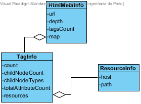

Documentação
==============================
Esta solução, foi desenvolvida e testada utilizando Node.js v6.10.0.
Para utilizar, descarregar o ficheiro challenge_accepted.tar.gz, descompactar e executar:

```
tar zxvf jscrambler_challenge_accepted.tar.gz
cd jscrambler_challenge_accepted/
node app.js HOST [FILENAME]
```

## Descrição da solução

Sendo que um dos requisitos seria a utilização de ES6, utilizou-se o paradigma de programação orientada ao objecto, pelo
 que o modelo de domínio representativo das classes utilizadas se segue:
 


### Pressupostos assumidos

Sendo o primeiro requisito o de descobrir a frequência de cada tag HTML no documento,
assumiu-se que os seguintes requisitos (atributos, nr. de filhos, tipo de filhos, recursos descarregados) se referiam,
também, para cada uma das tags. 

### Optimização

Nesta solução, sendo o ponto crítico de performance, aquele em que se percorre a àrvore DOM, procurou-se utilizar um
algoritmo recursivo de pesquisa em profundidade, por forma a descobrir a profundidade da àrvore, ao mesmo tempo que é
atravessada.

### Qualidade

Para assegurar a correção da solução foram criados testes, abrangendo os algoritmos que ao *parsing* de HTML dizem
respeito.
Não foram realizados testes às funcionalidades de apresentação de resultados.
Para realizar os testes:

````
npm test
````

Exercício Prático - Jscrambler
==============================

Pretende-se que seja implementada uma CLI (Command Line Interface) em Node.js que
receba como input um URL para um recurso HTML remoto e que devolva como output
um JSON com meta informação relevante sobre a markup obtida.

Exemplos de meta informação pertinente:

* Contagem de tags HTML (por nome);
* Contagem de atributos por tag HTML;
* Tipos de recursos descarregados (imagem, vídeo, etc) e hosts de onde foram
  descarregados;
* Número de filhos e quais, por tipo de tag HTML;
* A profundidade da árvore;

Toda a meta informação adicional será considerada e valorizada.

## Requisitos

- Desenvolver a solução em ES6;
- Produção de testes unitários;
- Produção de documentação.

O resultado esperado vai além da funcionalidade, sendo avaliado aspectos críticos como:

* desempenho do código / escalabilidade
* aspectos de segurança
* qualidade do código

## Entrega

A entrega deve ser feita, enviando um arquivo `tar.gz` que contenha o
repositório bem como qualquer outro elemento produzido e relevante para a
avaliação da solução entregue.
